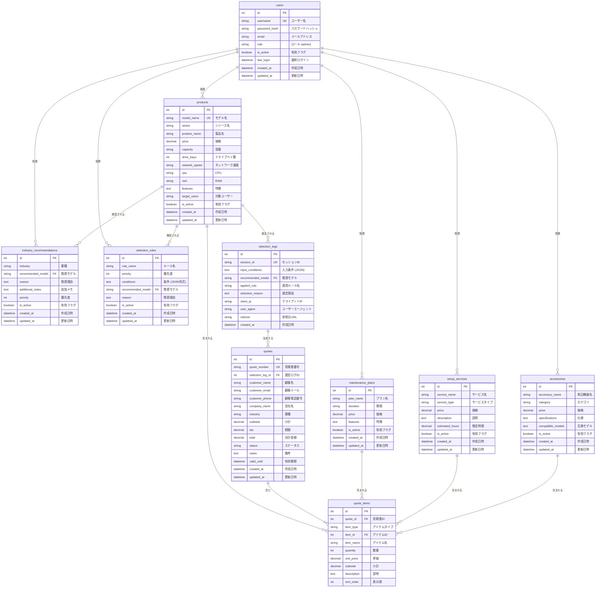

# QNAP提案システム データベースER図

このドキュメントは、WEB2システムのデータベース構造をMermaid形式のER図で表現したものです。

## ER図



## エンティティ説明

### 1. users（管理者ユーザーマスタ）
システムの管理者アカウント情報を管理します。JWT認証に使用されます。

**主要なフィールド:**
- `username`: ログインに使用するユーザー名（一意制約）
- `password_hash`: bcryptでハッシュ化されたパスワード
- `role`: ユーザーロール（現在は'admin'のみ）

### 2. products（製品マスタ）
QNAPのNAS製品情報を管理します。

**主要なフィールド:**
- `model_name`: モデル名（例: TS-233, TS-h765eU）
- `price`: 販売価格
- `capacity`: ストレージ容量
- `drive_bays`: ドライブベイ数
- `network_speed`: ネットワーク速度（例: 2.5GbE, 10GbE）

### 3. maintenance_plans（保守プランマスタ）
保守・メンテナンスプランの情報を管理します。

**主要なフィールド:**
- `plan_name`: プラン名（例: 3年保守、5年保守）
- `duration`: 保守期間
- `price`: プラン価格

### 4. setup_services（導入支援マスタ）
導入時の支援サービス情報を管理します。

**主要なフィールド:**
- `service_name`: サービス名（例: 基本導入支援）
- `service_type`: サービスタイプ
- `estimated_hours`: 作業見込み時間

### 5. accessories（周辺機器マスタ）
NAS本体と組み合わせて使用する周辺機器情報を管理します。

**主要なフィールド:**
- `accessory_name`: 周辺機器名（例: ラックマウントレール）
- `category`: カテゴリ分類
- `compatible_models`: 互換性のあるモデル情報

### 6. industry_recommendations（業種別推奨事項マスタ）
各業種に最適な製品推奨情報を管理します。

**主要なフィールド:**
- `industry`: 業種（例: 医療、製造業、官公庁）
- `recommended_model`: 推奨するモデル名（productsテーブルへの外部キー）
- `reason`: 推奨理由
- `priority`: 推奨優先度

### 7. selection_rules（製品選定ルール）
顧客の要件に基づいて製品を自動推奨するためのルールを管理します。

**重要性:**
このテーブルは、WEB1で JavaScript にハードコードされていた選定ロジックを
データベースで動的に管理できるようにする重要な機能です。

**主要なフィールド:**
- `rule_name`: ルール名（例: 10GbE必須（大規模））
- `priority`: ルール適用の優先度（数値が大きいほど優先）
- `conditions`: 適用条件（JSON形式で保存）
- `recommended_model`: 推奨するモデル名（productsテーブルへの外部キー）
- `reason`: 推奨理由

**条件の例（JSON形式）:**
```json
{
  "network": ["10gbe"],
  "users": ["50+"],
  "budget": ["300+"],
  "purposes": ["video", "virtualization"]
}
```

### 8. selection_logs（製品選定ログ）★新規追加★
製品選定機能が実行された際の記録を保存します。マーケティング分析や選定精度の改善に活用できます。

**主要なフィールド:**
- `session_id`: セッション識別子（UUID推奨）
- `input_conditions`: ユーザーが入力した条件（JSON形式）
- `recommended_model`: システムが推奨した製品モデル
- `applied_rule`: 適用された選定ルール名
- `selection_reason`: 選定理由
- `client_ip`: アクセス元IPアドレス
- `user_agent`: ブラウザ情報
- `referrer`: 参照元URL

**活用例:**
- 最も人気のある業種・用途の分析
- 選定パターンの傾向分析
- 推奨製品の精度評価
- 地域別の選定傾向
- 時間帯別のアクセス分析

**入力条件の例（JSON形式）:**
```json
{
  "industry": "medical",
  "users": "26-100",
  "capacity": "10-50TB",
  "downtime": "low",
  "budget": "medium",
  "network": "10gbe-required",
  "uses": ["file-sharing", "backup"]
}
```

### 9. quotes（見積書）★新規追加★
生成された見積書の情報を管理します。顧客情報と見積内容を保存します。

**主要なフィールド:**
- `quote_number`: 見積書番号（例: Q-20251113-0001）
- `selection_log_id`: 関連する選定ログID（任意）
- `customer_name`: 顧客名
- `customer_email`: 顧客メールアドレス
- `customer_phone`: 顧客電話番号
- `company_name`: 会社名
- `industry`: 業種
- `subtotal`: 小計
- `tax`: 税額
- `total`: 合計金額
- `status`: ステータス（draft, sent, approved, rejected, expired）
- `notes`: 備考・メモ
- `valid_until`: 見積有効期限

**活用例:**
- 見積書の管理・検索
- 成約率の分析
- 業種別の平均見積金額分析
- 季節ごとの見積傾向
- 顧客フォローアップ

### 10. quote_items（見積書明細）★新規追加★
見積書に含まれる個々のアイテム（製品・保守・導入支援・周辺機器）を管理します。

**主要なフィールド:**
- `quote_id`: 親となる見積書ID
- `item_type`: アイテムタイプ（product, maintenance, setup, accessory）
- `item_id`: 各マスタテーブルのID
- `item_name`: アイテム名（保存時点のスナップショット）
- `quantity`: 数量
- `unit_price`: 単価（保存時点のスナップショット）
- `subtotal`: 小計（quantity × unit_price）
- `description`: 説明・備考
- `sort_order`: 表示順

**設計のポイント:**
価格や製品名は見積書作成時点のスナップショットとして保存します。
これにより、後日マスタデータが変更されても見積書の整合性が保たれます。

**活用例:**
- 最も人気のある製品・オプションの分析
- セット販売パターンの発見
- クロスセル・アップセルの機会分析
- 平均構成金額の算出

## リレーションシップ

### ユーザーと各マスタテーブル
- users → products: 1対多（管理）
- users → maintenance_plans: 1対多（管理）
- users → setup_services: 1対多（管理）
- users → accessories: 1対多（管理）
- users → industry_recommendations: 1対多（管理）
- users → selection_rules: 1対多（管理）

### 製品と推奨テーブル
- products → industry_recommendations: 1対多
  - 1つの製品が複数の業種で推奨される可能性がある
  
- products → selection_rules: 1対多
  - 1つの製品が複数の選定ルールで推奨される可能性がある

### 選定ログと見積書の関係★新規追加★
- selection_logs → quotes: 1対多
  - 1回の製品選定から複数の見積書が生成される可能性がある
  - 例：同じ選定結果で異なる顧客向けの見積書を作成

- products → selection_logs: 1対多
  - 1つの製品が複数の選定ログで推奨される

### 見積書と明細の関係★新規追加★
- quotes → quote_items: 1対多（必須）
  - 1つの見積書は必ず1つ以上の明細を持つ
  
- products → quote_items: 1対多
  - 1つの製品が複数の見積明細で使用される
  
- maintenance_plans → quote_items: 1対多
  - 1つの保守プランが複数の見積明細で使用される
  
- setup_services → quote_items: 1対多
  - 1つの導入支援が複数の見積明細で使用される
  
- accessories → quote_items: 1対多
  - 1つの周辺機器が複数の見積明細で使用される

## データフロー

### 製品選定の流れ（選定ログ記録付き）
1. フロントエンドから顧客要件を受信
2. `selection_rules` テーブルから条件に合致するルールを検索（優先度順）
3. 該当ルールの `recommended_model` から `products` テーブルの製品情報を取得
4. `industry_recommendations` テーブルから業種別の追加推奨事項を取得
5. **★選定結果を `selection_logs` テーブルに記録**
6. すべての情報を統合してレスポンスを生成

### 見積書生成の流れ★新規追加★
1. ユーザーが見積書作成を開始（選定結果から or 手動作成）
2. 顧客情報を入力（名前、メール、会社名など）
3. 製品・オプションを選択・編集
4. `quotes` テーブルに見積書ヘッダー情報を保存
5. `quote_items` テーブルに各アイテムの明細を保存（価格はスナップショット）
6. 見積書番号を自動生成（例: Q-20251113-0001）
7. 見積書PDF生成 or メール送信

## インデックス推奨

パフォーマンス向上のため、以下のカラムにインデックスを作成することを推奨します:

**マスタテーブル:**
- `products.model_name` (UNIQUE)
- `users.username` (UNIQUE)
- `industry_recommendations.industry`
- `industry_recommendations.recommended_model`
- `selection_rules.priority`
- `selection_rules.recommended_model`

**トランザクションテーブル:**★新規追加★
- `selection_logs.session_id` (UNIQUE)
- `selection_logs.recommended_model`
- `selection_logs.created_at`
- `quotes.quote_number` (UNIQUE)
- `quotes.customer_email`
- `quotes.status`
- `quotes.created_at`
- `quote_items.quote_id`
- `quote_items.item_type`
- `quote_items.item_id`

## 集計レポート例★新規追加★

### 1. 製品選定分析レポート

**人気製品ランキング:**
```sql
SELECT 
    recommended_model,
    COUNT(*) as selection_count,
    COUNT(DISTINCT DATE(created_at)) as days_selected
FROM selection_logs
WHERE created_at >= DATE('now', '-30 days')
GROUP BY recommended_model
ORDER BY selection_count DESC
LIMIT 10;
```

**業種別選定傾向:**
```sql
SELECT 
    JSON_EXTRACT(input_conditions, '$.industry') as industry,
    recommended_model,
    COUNT(*) as count
FROM selection_logs
WHERE created_at >= DATE('now', '-90 days')
GROUP BY industry, recommended_model
ORDER BY industry, count DESC;
```

**選定ルール適用状況:**
```sql
SELECT 
    applied_rule,
    COUNT(*) as usage_count,
    COUNT(DISTINCT session_id) as unique_sessions
FROM selection_logs
WHERE created_at >= DATE('now', '-30 days')
GROUP BY applied_rule
ORDER BY usage_count DESC;
```

### 2. 見積書分析レポート

**月次見積統計:**
```sql
SELECT 
    strftime('%Y-%m', created_at) as month,
    COUNT(*) as quote_count,
    AVG(total) as avg_amount,
    SUM(total) as total_amount,
    SUM(CASE WHEN status = 'approved' THEN 1 ELSE 0 END) as approved_count
FROM quotes
GROUP BY month
ORDER BY month DESC;
```

**業種別平均見積金額:**
```sql
SELECT 
    industry,
    COUNT(*) as quote_count,
    AVG(total) as avg_amount,
    MIN(total) as min_amount,
    MAX(total) as max_amount
FROM quotes
WHERE status != 'draft'
GROUP BY industry
ORDER BY avg_amount DESC;
```

**成約率分析:**
```sql
SELECT 
    strftime('%Y-%m', created_at) as month,
    COUNT(*) as total_quotes,
    SUM(CASE WHEN status = 'approved' THEN 1 ELSE 0 END) as approved,
    ROUND(100.0 * SUM(CASE WHEN status = 'approved' THEN 1 ELSE 0 END) / COUNT(*), 2) as approval_rate
FROM quotes
WHERE status IN ('approved', 'rejected', 'expired')
GROUP BY month
ORDER BY month DESC;
```

### 3. オプション販売分析

**人気オプション組み合わせ:**
```sql
SELECT 
    qi1.item_name as product,
    qi2.item_name as option,
    COUNT(*) as combination_count
FROM quote_items qi1
JOIN quote_items qi2 ON qi1.quote_id = qi2.quote_id
WHERE qi1.item_type = 'product' 
  AND qi2.item_type IN ('maintenance', 'setup', 'accessory')
GROUP BY qi1.item_name, qi2.item_name
ORDER BY combination_count DESC
LIMIT 20;
```

**オプション付帯率:**
```sql
SELECT 
    item_type,
    COUNT(DISTINCT quote_id) as quotes_with_item,
    ROUND(100.0 * COUNT(DISTINCT quote_id) / (SELECT COUNT(*) FROM quotes), 2) as attachment_rate
FROM quote_items
WHERE item_type != 'product'
GROUP BY item_type;
```

### 4. 顧客分析

**リピート顧客検出:**
```sql
SELECT 
    customer_email,
    customer_name,
    company_name,
    COUNT(*) as quote_count,
    SUM(total) as total_value,
    MIN(created_at) as first_quote,
    MAX(created_at) as last_quote
FROM quotes
GROUP BY customer_email
HAVING quote_count > 1
ORDER BY total_value DESC;
```

### 5. ダッシュボード用KPI

**本日の統計:**
```sql
SELECT 
    (SELECT COUNT(*) FROM selection_logs WHERE DATE(created_at) = DATE('now')) as today_selections,
    (SELECT COUNT(*) FROM quotes WHERE DATE(created_at) = DATE('now')) as today_quotes,
    (SELECT COALESCE(SUM(total), 0) FROM quotes WHERE DATE(created_at) = DATE('now')) as today_quote_value,
    (SELECT COUNT(*) FROM quotes WHERE status = 'approved' AND DATE(updated_at) = DATE('now')) as today_approvals;
```

**月次目標達成率:**
```sql
SELECT 
    COUNT(*) as monthly_quotes,
    SUM(CASE WHEN status = 'approved' THEN 1 ELSE 0 END) as approved_count,
    SUM(CASE WHEN status = 'approved' THEN total ELSE 0 END) as approved_amount,
    ROUND(100.0 * SUM(CASE WHEN status = 'approved' THEN 1 ELSE 0 END) / COUNT(*), 2) as conversion_rate
FROM quotes
WHERE strftime('%Y-%m', created_at) = strftime('%Y-%m', 'now');
```

## 今後の拡張案

### 短期拡張（実装済み）
- ✅ `selection_logs` テーブル: 製品選定履歴を記録
- ✅ `quotes` テーブル: 見積書情報
- ✅ `quote_items` テーブル: 見積書明細
- [ ] `operation_logs` テーブル: 管理者の操作履歴を記録
- [ ] `price_history` テーブル: 価格変更履歴を記録

### 中期拡張
- [ ] `customers` テーブル: 顧客マスタ（重複顧客の統合管理）
- [ ] `customer_contacts` テーブル: 顧客担当者情報
- [ ] `quote_templates` テーブル: 見積テンプレート
- [ ] `email_logs` テーブル: メール送信履歴
- [ ] `quote_versions` テーブル: 見積書の改訂履歴
- [ ] `inventory` テーブル: 在庫管理
- [ ] `sales_opportunities` テーブル: 商談管理

### 長期拡張
- [ ] `ab_tests` テーブル: 選定ルールのA/Bテスト管理
- [ ] `feedback` テーブル: 顧客フィードバック収集
- [ ] `ml_predictions` テーブル: 機械学習による予測結果
- [ ] `analytics_cache` テーブル: 集計結果のキャッシュ
- [ ] `notifications` テーブル: 通知管理
- [ ] `workflow_tasks` テーブル: ワークフロー管理

## API拡張案★新規追加★

### 選定ログ記録API

#### POST /api/selection/log
製品選定実行時に自動的にログを記録

**リクエスト:**
```json
{
  "session_id": "uuid-v4-string",
  "input_conditions": {
    "industry": "medical",
    "users": "26-100",
    "capacity": "10-50TB",
    "network": "10gbe-required"
  },
  "recommended_model": "TS-h765eU",
  "applied_rule": "10GbE必須（中規模）",
  "selection_reason": "医療業界向け、10GbE必須要件を満たし、高可用性を実現"
}
```

### 見積書管理API

#### POST /api/quotes
見積書新規作成

**リクエスト:**
```json
{
  "selection_log_id": 123,
  "customer_name": "山田太郎",
  "customer_email": "yamada@example.com",
  "customer_phone": "03-1234-5678",
  "company_name": "〇〇病院",
  "industry": "medical",
  "items": [
    {
      "item_type": "product",
      "item_id": 5,
      "quantity": 1
    },
    {
      "item_type": "maintenance",
      "item_id": 2,
      "quantity": 1
    }
  ],
  "notes": "納期は来月末を希望",
  "valid_until": "2025-12-31"
}
```

**レスポンス:**
```json
{
  "quote_id": 456,
  "quote_number": "Q-20251113-0001",
  "subtotal": 897800,
  "tax": 89780,
  "total": 987580,
  "status": "draft"
}
```

#### GET /api/quotes
見積書一覧取得（検索・フィルタ機能付き）

**クエリパラメータ:**
- `status`: ステータスフィルタ
- `industry`: 業種フィルタ
- `date_from`, `date_to`: 日付範囲
- `customer_email`: 顧客メール検索
- `sort`: ソート順（created_at, total, status）

#### GET /api/quotes/:id
見積書詳細取得（明細含む）

#### PUT /api/quotes/:id
見積書更新

#### DELETE /api/quotes/:id
見積書削除（論理削除推奨）

#### POST /api/quotes/:id/send
見積書をメール送信

#### GET /api/quotes/:id/pdf
見積書PDF生成・ダウンロード

### 分析・レポートAPI

#### GET /api/analytics/selections
選定ログの集計データ取得

**クエリパラメータ:**
- `period`: 期間（7days, 30days, 90days, 1year）
- `group_by`: グループ化（model, industry, rule）

**レスポンス例:**
```json
{
  "period": "30days",
  "total_selections": 1234,
  "top_models": [
    {"model": "TS-h765eU", "count": 456, "percentage": 37.0},
    {"model": "TS-432PXU", "count": 321, "percentage": 26.0}
  ],
  "top_industries": [
    {"industry": "medical", "count": 389, "percentage": 31.5},
    {"industry": "manufacturing", "count": 278, "percentage": 22.5}
  ]
}
```

#### GET /api/analytics/quotes
見積書の集計データ取得

**レスポンス例:**
```json
{
  "period": "30days",
  "total_quotes": 89,
  "total_value": 78965000,
  "avg_quote_value": 887360,
  "status_breakdown": {
    "draft": 23,
    "sent": 34,
    "approved": 18,
    "rejected": 10,
    "expired": 4
  },
  "conversion_rate": 20.2
}
```

#### GET /api/analytics/dashboard
ダッシュボード用KPI一括取得

**レスポンス例:**
```json
{
  "today": {
    "selections": 45,
    "quotes": 8,
    "quote_value": 6780000,
    "approvals": 2
  },
  "this_month": {
    "selections": 1234,
    "quotes": 89,
    "quote_value": 78965000,
    "approvals": 18,
    "conversion_rate": 20.2
  },
  "trending_products": [...],
  "recent_quotes": [...]
}
```

---

**作成日:** 2025年11月13日  
**バージョン:** 2.0  
**更新内容:** 選定ログ・見積書管理機能を追加  
**関連ドキュメント:**
- [実装計画書](implementation_plan.md)
- [選定ルールガイド](selection_rules_guide.md)

## 実装優先度とメリット

### 選定ログ機能（selection_logs）
**優先度: 高**

**メリット:**
1. **マーケティングインサイト**
   - どの業種・用途が多いかを把握
   - 人気製品の傾向分析
   - 地域別の需要把握

2. **選定精度の改善**
   - 選定ルールの効果測定
   - A/Bテスト実施の基礎データ
   - ユーザー行動の理解

3. **営業戦略の最適化**
   - 注力すべき市場セグメントの特定
   - 在庫計画の最適化
   - プロモーション効果の測定

**実装コスト: 低**
- 選定API実行時に1レコード追加するだけ
- 非同期処理で実装可能（パフォーマンス影響なし）

### 見積書管理機能（quotes, quote_items）
**優先度: 高**

**メリット:**
1. **業務効率化**
   - 見積書の一元管理
   - 再利用・複製が容易
   - 検索・履歴管理

2. **売上分析**
   - 成約率の把握
   - 平均単価の追跡
   - 季節変動の分析

3. **顧客関係管理**
   - 顧客ごとの見積履歴
   - フォローアップ管理
   - リピート顧客の特定

4. **価格戦略**
   - 競合分析の基礎データ
   - 値引き傾向の把握
   - 利益率の最適化

**実装コスト: 中**
- 見積書作成UI
- PDF生成機能
- メール送信機能

### 推奨実装順序

1. **フェーズ1: 選定ログ（1-2日）**
   - `selection_logs` テーブル作成
   - 選定API実行時の自動記録
   - 基本的な集計クエリ実装

2. **フェーズ2: 見積書基本機能（3-5日）**
   - `quotes`, `quote_items` テーブル作成
   - 見積書作成・編集API
   - 見積書一覧・検索API

3. **フェーズ3: 見積書拡張機能（3-5日）**
   - PDF生成機能
   - メール送信機能
   - ステータス管理

4. **フェーズ4: 分析・レポート機能（5-7日）**
   - 管理画面のダッシュボード
   - 各種集計レポート
   - グラフ・チャート表示

**合計実装期間: 2-3週間**

### データプライバシー考慮事項

1. **個人情報保護**
   - 顧客情報（メール、電話）は暗号化推奨
   - アクセスログの記録
   - GDPR対応（削除権の実装）

2. **IPアドレスの取り扱い**
   - 匿名化オプションの提供
   - 保存期間の設定（例: 1年後に自動削除）

3. **データ保持ポリシー**
   - 古いログの定期削除
   - アーカイブ機能
   - バックアップ戦略
